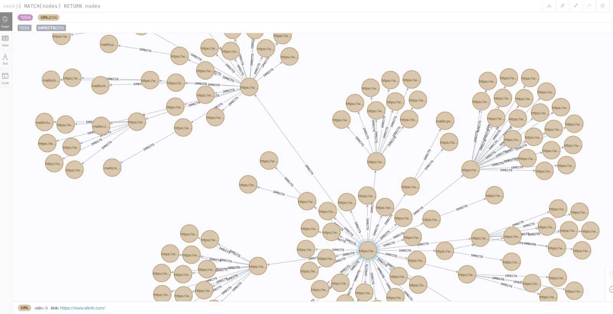

### Link Crawler

The aim of this project is to extract and graph all the links that
can be reached through the given link.

#### Requirements

- Docker
- Docker compose

#### Run

Project can run with `docker-compose up` command.

#### Project outline

##### Master Node

Master node is responsible for writing links that to be crawled to the kafka topic.
Moreover, it processes responses of worker nodes, and write them to the graph database.

##### Worker Node(s)

Worker nodes are dummy and size of these can be increased to achieve better performance.
These nodes read links to be crawled kafka topic, crawl and write its findings to different kafka topic.

##### Storage

To be able to store and present connections, this project is using [neo4j](https://neo4j.com/) graph databases.
neo4j has web interface in it that helps both querying and presenting the stored data.

Example graph output can be seen as follows;

